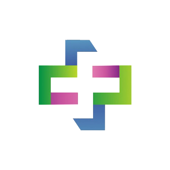
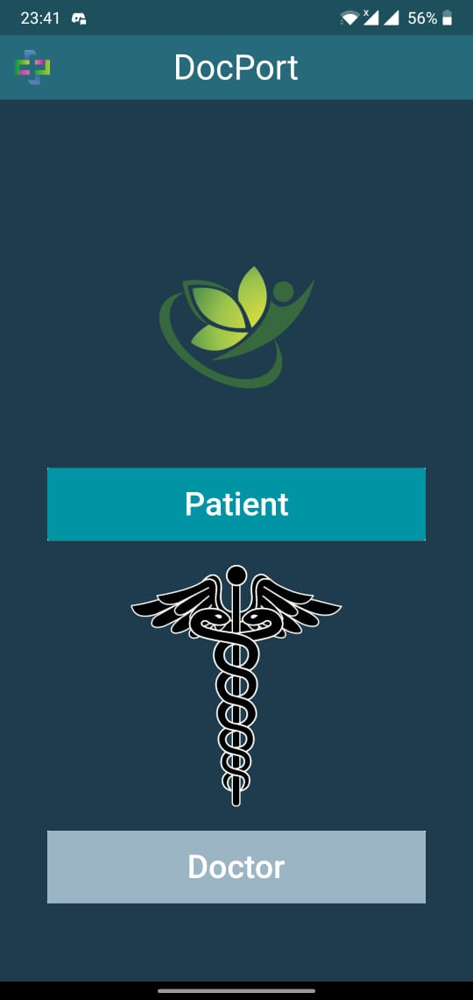
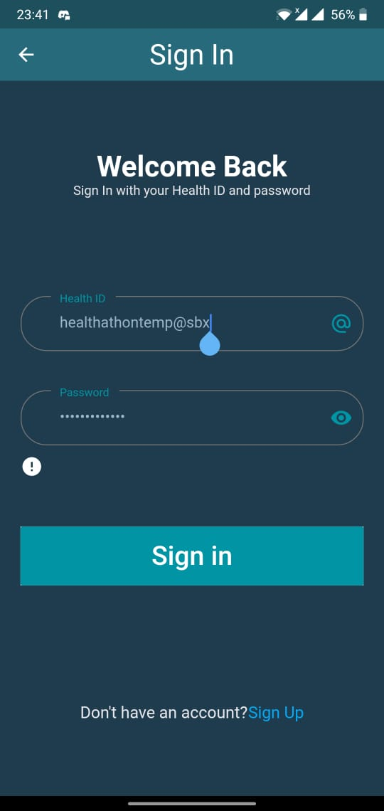
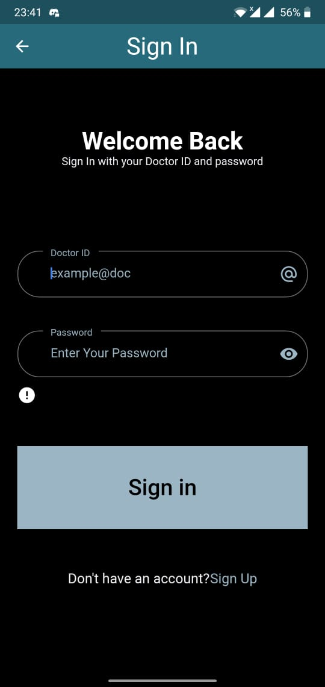
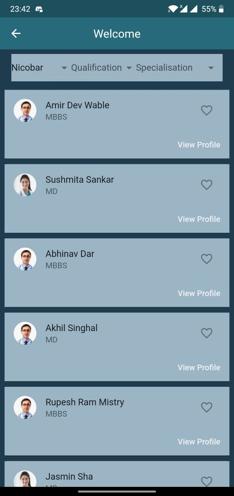

# DocPort

Finding the best healthcare provider and making the appointment process convenient.

(This project was made while participating for Healthathon 2020)

## Description

India is a diverse country and now in this tough time where the entire country is fighting with a deadly virus, it has become difficult for the senior citizens and the little ones to move out even for a regular health checkup. This app is a small initiative made by Team DOT to help not only them but all age groups to avoid physically going and waiting in queues for a regular check-up. By using DOCPORT, patients/healthcare seekers will be able to book appointments to visit their trusted doctors and avoid the long crowded queue for safety purposes.

Presently, finding the right doctor is based on word of mouth and a patient cannot know beforehand which doctor is suitable for them. To solve this, our app makes it easy to find the right healthcare provider for the user and makes the appointment process easy.

With the help of NDHM APIs, the doctor has easy access to the patient's health records using DocPort.

## Screenshots

  
  
   
  
  

